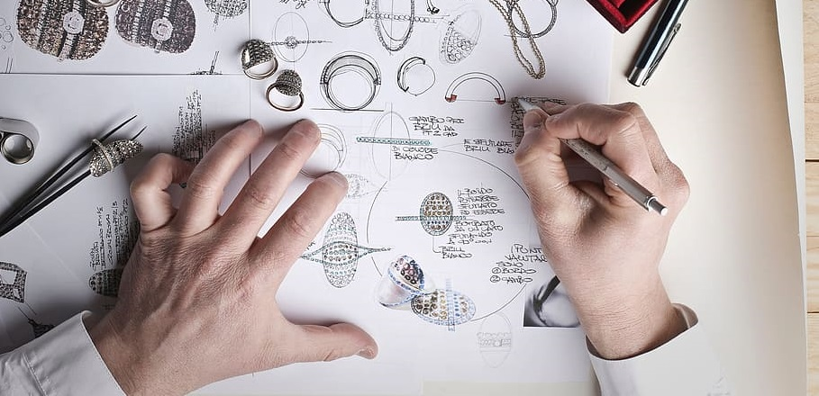
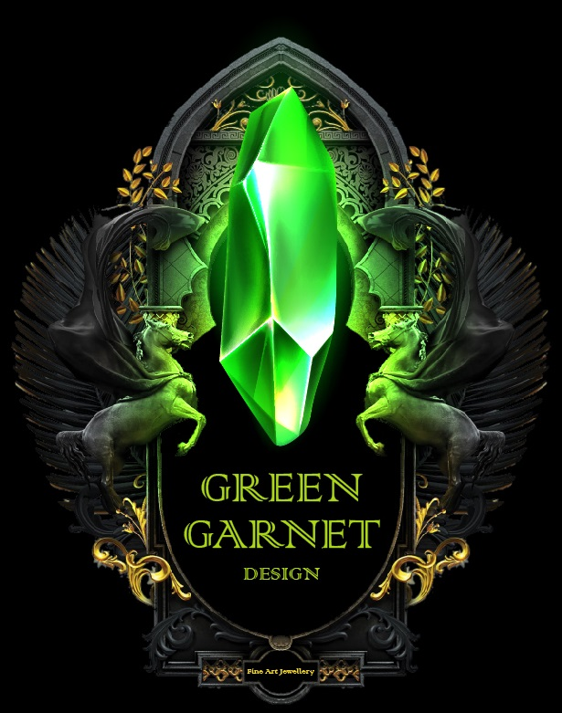
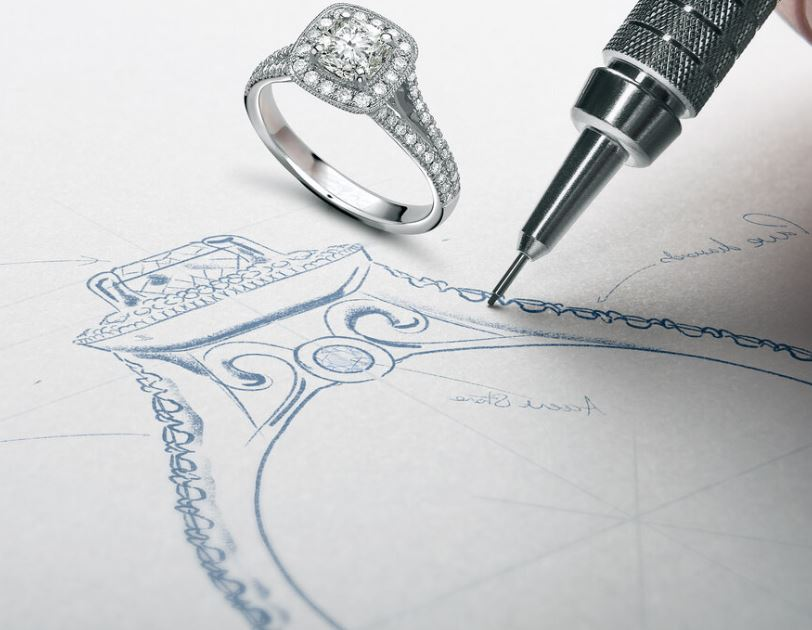
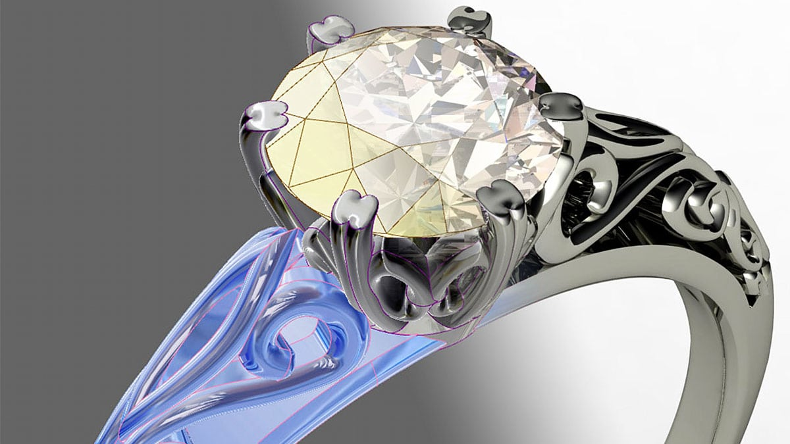
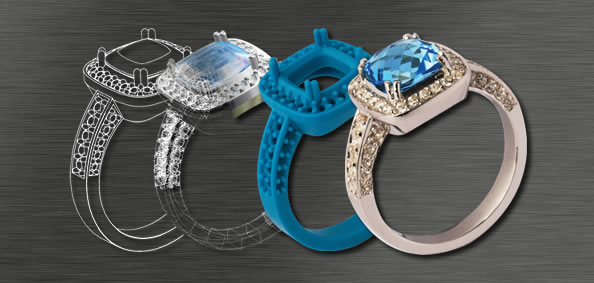
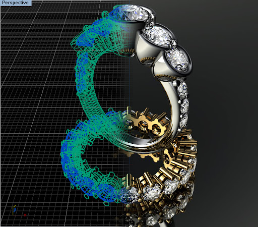

# Design Your Own Dream

### Perhaps you want to create something unique but don't know where to begin?
Let us handle the design.

We'll assist you in identifying the jewellery styles that appeal to you. Our designers will accompany you as you peruse our extensive jewellery selection, assisting you in identifying the design elements that appeal to you. Our designers will create an original piece of jewellery that fits your lifestyle and budget after assisting you in discovering the possibilities. 

There is no limit to the creativity you may express with precious metals and diamonds; if you see a design you like and want to put that into practice, we can assist you. Our designers can work with you on economics, feasibility, lengthy use, and cost effectiveness. This is a fun and gratifying procedure that ends with a unique piece of exquisite jewellery that you designed yourself. The best thing is that some of the finest jewellers in the world will put your vision into reality. 

Existing jewellery is frequently the inspiration for new custom creations. When a customer sees a piece of jewellery they like, but they prefer it with a different stone shape, size or colors, it happens all the time. Frequently, our clients want a product that is a little thinner, longer, or taller, or prefer a different texture or pattern than what is currently available. We're frequently tasked with coming up with solutions to make identical jewellery for less money.
We're Jewelry Designs, so no worries there! We'll personalize it to your specifications!

Unless the finishing are flawless, you've probably discovered the perfect design.
Changing the sort of stone or the precious metal used may be all that is required to suit your preferences. 

We've done a lot of work on replicating family treasures for our customers.
Occasionally, a second piece of jewellery is created for a different member of the family.
You'll also have to replace any worn-out or missing beloved jewellery pieces.
Most jewellery products can be redesigned or replicated by our team of designers for you as long as recreating the item does not violate trademark or patent rights.
If the stones or materials of a family heirloom carry sentimental importance, you may choose to repair the original jewellery.
If this is the case, you may opt to have the item restored.
A professional designer will look for the safest repair procedure while keeping faithful to the original materials and style. 

Designing jewelry from home can be fun and rewarding. Through Jewelry Designs’ virtual jewelry service, you will have direct access to a designer and a personal shopper.

## 1. Chat With A Representative:
One of our designers will be with you shortly.From there, we will schedule a call or arrange a meeting to get started.

## 2. Actualize Your Concept:
Your jewelry designer will begin by establishing your needs and gathering relevant materials related to your project. From there, they will develop your idea and communicate with you using photos, computer generated renderings, and various design tools available to help you visualize your masterpiece.

## 3. Create Your Jewelry:
Once we have earned your complete confidence, we will customize a piece of fine jewelry to your specifications.
