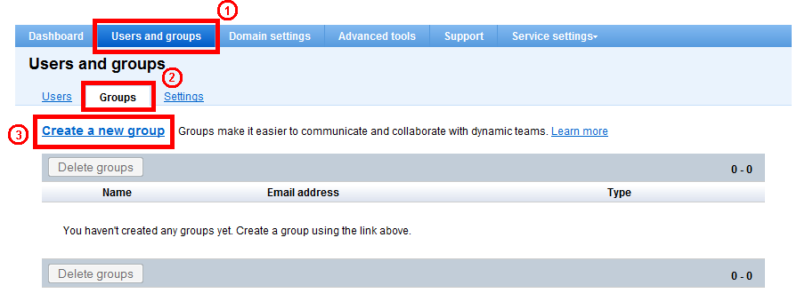
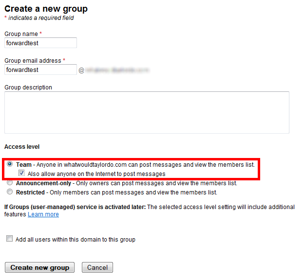
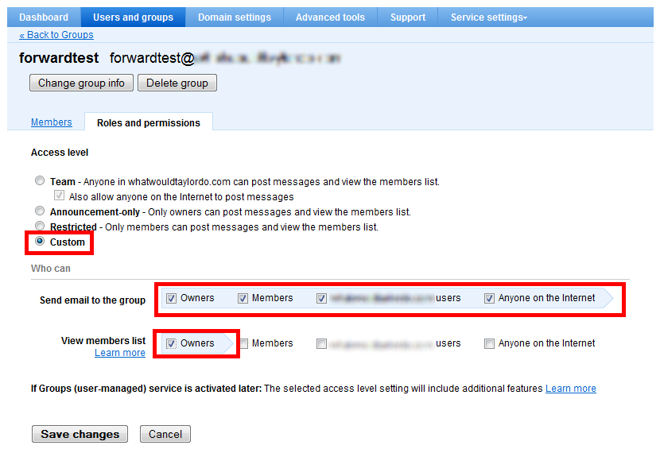
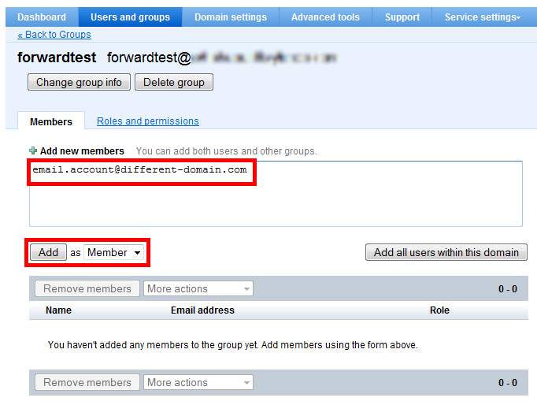

If you’ve signed up for Google Apps, it may not be immediately apparent if email forwarders are supported; fortunately for everyone, they are. But they’re not called “forwarders” and aren’t managed quite like traditional forwarders. Instead, Google Apps provides a much more robust Groups feature which allows greater control over who can send mail and how many people receive it. With just a few steps, we can configure Groups to act just like a traditional forwarder.

First, ensure that you’re in the right place by getting to the groups section. Select the “Users and Groups” tab, Groups sub-tab, then click on “Create a new group”.

Enter the name and address of the group. Set the Access level to “Team” and check the checkbox labeled “Also allow anyone on the internet to post messages”. When done, click “Create new group”.

This next step is technically optional, but necessary if you’d like to restrict normal members from seeing the contents of the forwarder. If this is the case, we need to set custom permissions and de-select all but “Owner” for “View member list”. If this doesn’t concern you, feel free to skip this.

Finally, we need to add actual addresses to forward to. And this is the beauty of Google, is that you can forward to as many email addresses as necessary. If you only need to enter a single address, that’s fine too.

